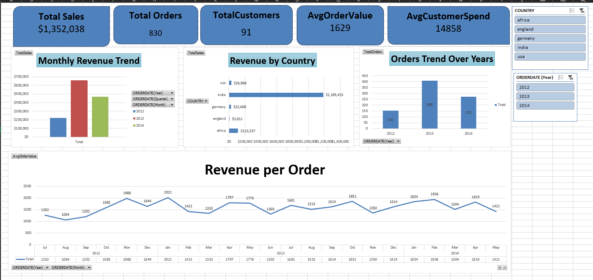

# Global Sales & Revenue Dashboard (Excel)

An interactive Excel dashboard analyzing global sales data, tracking over $1.35M in revenue, order trends, and customer demographics across multiple countries from 2012-2014.

## 📊 Dashboard Preview

## 💡 Key Performance Indicators (KPIs)
Based on the dashboard analysis, the business has achieved:
* **Total Sales:** $1,352,038
* **Total Orders:** 830
* **Total Customers:** 91
* **Average Order Value:** $1,629
* **Average Customer Spend:** $14,858

## 📈 Dashboard Features & Visualizations
* **Revenue by Country:** A horizontal bar chart highlighting sales across key regions (India, USA, Germany, England, Africa), revealing that **India** is the dominant market with over $1.18M in revenue.
* **Orders Trend Over Years:** Tracks the growth and fluctuation of order volumes across 2012 (152), 2013 (408), and 2014 (270).
* **Monthly Revenue Trend:** Compares revenue generation month-by-month and year-by-year to identify seasonal peaks.
* **Revenue per Order:** A detailed line chart showing the fluctuation in revenue per order chronologically over the months.
* **Interactive Slicers:** Allows users to filter the dashboard dynamically by **Country** and **Order Date (Year)**.

## 🗂️ Data Structure
The analysis is built on a relational data model consisting of three main tables:
1. **Customers:** Contains demographic data including `ID`, `Name`, `CITY`, `COUNTRY`, and `PHONE`.
2. **Orders:** Logs transactional data including Order `ID`, `Date`, Customer references, and total transaction amounts.
3. **OrderItems:** Granular line-item details including `ID`, `ORDERID`, `PRODUCTID`, `UNITPRICE`, and `QUANTITY`.

## 🛠️ Tools Used
* **Microsoft Excel:** Data cleaning, Pivot Tables, Pivot Charts, interactive Dashboards with Slicers.

## 🚀 How to Use
1. Download the Excel `.xlsx` file from this repository.
2. Open the file in Microsoft Excel.
3. Navigate to the **Dashboard** sheet.
4. Use the Slicers on the right-hand side to filter the data by specific years (2012, 2013, 2014) or specific countries to see the charts update dynamically.